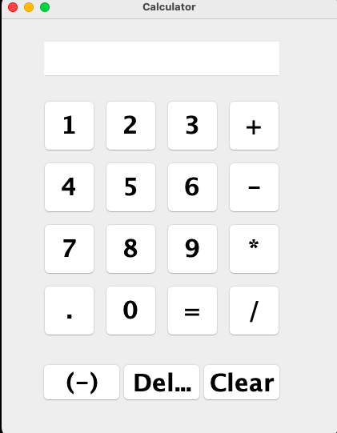

# Calculator Desktop App In Java
- **Simple approach building a calculator that can compute basic arithmetic. The desktop application uses Java Swing and Java awt classes for the user interface.**
# Usage
- `git clone https://github.com/darioblopes/calculator-desktop-app.git`
- `cd src/`
- `javac Calculator.java`
- `java Calculator`
# Preview
